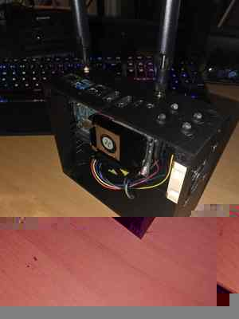

# Cometen IRL System

Cometen IRL System is the central IRL control, monitoring and return-channel project used with the Cometen BELABOX setup.

> **Unofficial project:** Cometen IRL System is not an official BELABOX project and is not developed, maintained, endorsed or supported by BELABOX. It is an independent personal add-on/modification project created by Cometen for his own BELABOX-based IRL streaming setup.



*Current Cometen BELABOX prototype. This photo will be replaced by final enclosure photos after the remaining hardware is installed.*

It combines:

- alert delivery from Streamer.bot/CometenWebAdmin to BELABOX
- PHP/MySQL HTTPS relay with lease/acknowledgement
- local PipeWire/Bluetooth alert playback on ROCK 5B+
- remote speaker control and expanded status
- headless Browser Source audio on BELABOX
- multi-source Browser Audio management
- receiver heartbeat and diagnostics
- physical status LEDs
- BELABOX/SRT ingest watchdog
- OBS failover and automatic recovery
- IRL stream start/BRB/end/admin commands
- optional Channel Point mode switching
- Twitch URL safety for URL-bearing commands

Repository:

```text
https://github.com/la1ona/CometenIRLSystem
```

## Architecture

```text
Twitch / YouTube / CometenWebAdmin
        |
        v
Streamer.bot on streaming PC
        |
        | HTTPS
        v
PHP/MySQL relay on web host
        |
        +---------------------------+
        |                           |
        | alerts / control          | heartbeat/status
        v                           v
ROCK 5B+ receiver              receiver status
        |
        v
PipeWire / Bluetooth / local WAV files

Browser Sources
        |
        +--> Sound Alerts --> OBS on streaming PC
        |                \-> BELABOX Browser Audio [soundalerts] --+
        +--> Blerp/other ----> BELABOX Browser Audio [source] ------+--> PipeWire --> Bluetooth

BELABOX Cloud/SRT ingest telemetry
        |
        v
IRLAlertsController in Streamer.bot
        |
        +--> BELABOX SRT
        +--> IRL - SIGNAL MISTET
```

## Documentation

Start here:

- [Documentation Home](docs/README.md)
- [Installation](docs/INSTALLATION.md)
- [Architecture](docs/architecture.md)
- [Module Overview](docs/MODULES.md)
- [Complete Command Reference](docs/COMMANDS.md)

Feature guides:

- [Browser Audio](docs/BROWSER_AUDIO.md)
- [Remote Control](docs/REMOTE_CONTROL.md)
- [OBS IRL Admin Control](docs/OBS_ADMIN_CONTROL.md)
- [Watchdog and Heartbeat](docs/WATCHDOG_HEARTBEAT.md)
- [Status LEDs](docs/STATUS_LEDS.md)
- [Twitch Chat URL Guard](docs/CHAT_URL_GUARD.md)
- [BELABOX Headless Bluetooth Setup](docs/BELABOX_HEADLESS.md)
- [BELABOX Stability Notes](docs/BELABOX_STABILITY.md)
- [Streamer.bot Setup](docs/streamerbot-setup.md)
- [Receiver Setup](docs/receiver-setup.md)
- [Relay Setup](docs/relay-setup.md)
- [CometenWebAdmin Integration](integration/cometenwebadmin/README.md)

## Main modules

### Streamer.bot sender

`streamerbot/CometenIRL_Send.cs`

Sends alert events to the HTTPS relay.

### Remote Control

`streamerbot/CometenIRL_RemoteControl.cs`

Controls BELABOX speaker volume/mute/status/test through the relay and confirmed receiver results.

### Browser Audio Control

`streamerbot/CometenIRL_BrowserAudioControl.cs`

Controls named headless Browser Sources on BELABOX through `!irlaudio`.

### OBS IRL Admin Control

`streamerbot/CometenIRL_AdminControl.cs`

Controls Starting Soon, BELABOX SRT, BRB, Ending, stop, scene aliases, Channel Points and persistent response language.

### BELABOX receiver

`receiver/receiver.py` and `receiver/run_receiver.py`

Polls the relay, plays local alerts, executes supported remote-control actions and publishes confirmed results.

### Browser Audio supervisor

`receiver/browser_audio.py`

Runs one headless Chromium process/profile per configured Browser Source and routes audio through PipeWire/Bluetooth.

### Ingest watchdog

`streamerbot/IRLAlertsController.cs`

Uses BELABOX/SRT ingest telemetry to perform automatic OBS fallback/recovery.

## IRL chat commands

Main command groups include:

```text
!irlstatus
!alerttest
!volum 0-100
!volup
!voldown
!mute
!unmute

!irlstart
!irlgo
!irlbrb
!irlback
!irlend
!irlstop
!irlscene <alias>
!irlpoints on|off
!irllang no|en

!irlaudio status
!irlaudio on|off|restart
!irlaudio add <name> <url>
!irlaudio remove <name>
!irlaudio <name> on|off|restart|status
```

See [Complete Command Reference](docs/COMMANDS.md).

## Verified functionality

The real BELABOX/streaming setup has production-tested or directly exercised:

- HTTPS sender -> relay -> receiver path
- lease/acknowledgement and confirmed control results
- local PipeWire/Bluetooth audio
- receiver heartbeat
- status/volume/mute/test remote control
- Sound Alerts Browser Audio on ROCK 5B+
- simultaneous Sound Alerts playback in OBS and on the BELABOX Bluetooth speaker
- Browser Audio master status/on/off command path
- adding a second named Browser Audio source through Twitch chat
- automatic deletion of the private URL-bearing Browser Audio add message
- per-source Browser Audio on/off command path
- BELABOX ingest signal-loss fallback and stable recovery
- live-only watchdog gating
- IRL Starting Soon / live / BRB / Ending workflow
- automatic Ending stop and IRL mode lifecycle
- persistent NO/EN response language
- optional Channel Point group switching
- physical status LED/video-probe integration

Independent audio playback from each newly added third-party Browser Source should still be validated provider by provider.

## Fresh installation path

A new clone uses the new repository/directory name:

```bash
cd ~
git clone https://github.com/la1ona/CometenIRLSystem.git
cd CometenIRLSystem
```

## Existing installations after the repository rename

Existing BELABOX installations may still be located at:

```text
~/CometenIRLAlerts
```

That local directory name does not need to be changed immediately. GitHub redirects the renamed repository, and keeping the existing directory avoids breaking installed systemd service paths.

For an existing installation, continue using its current local directory until a deliberate local-path migration is performed.

Typical update on the current BELABOX installation therefore remains:

```bash
cd ~/CometenIRLAlerts
git pull
cd receiver
bash install-user-service.sh
systemctl --user restart cometen-irl-alerts.service
systemctl --user restart cometen-irl-heartbeat.service
```

For a fresh installation cloned after the rename, use `~/CometenIRLSystem` instead.

If Browser Audio changed:

```bash
systemctl --user restart cometen-irl-browser-audio.service
```

Relay PHP files are hosted separately and must be uploaded to the web host when they change; a BELABOX `git pull` does not update the web host.

## Compatibility names intentionally retained

The repository/project branding is now **Cometen IRL System**, but existing runtime identifiers are intentionally retained for compatibility unless a separate migration is performed. This includes names such as:

```text
CometenIRL_*
cometen-irl-alerts.service
CometenIRL_Send.cs
CometenIRL_RemoteControl.cs
CometenIRL_AdminControl.cs
```

Changing these identifiers is not required for the repository rename and could break existing Streamer.bot actions, globals or installed services.

## Security

Never commit:

```text
relay/config.php
receiver/config.json
```

Never publish:

- sender token
- receiver token
- database password
- BELABOX stream ID
- private Browser Source URLs/tokens

## Design rule

Keep IRL-specific alerting, remote control, Browser Audio, heartbeat, physical status, BELABOX/SRT watchdog and OBS failover coordinated inside this project.

Do not run another automatic scene switcher such as NOALBS in parallel with `IRLAlertsController` unless the scene-authority model is deliberately redesigned and retested.
