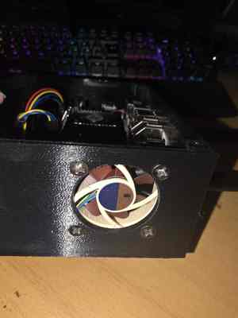

# BELABOX Stability Notes

This page documents stability-oriented changes and diagnostic practices for the Cometen BELABOX setup.

## 1. Fan hysteresis



*Prototype enclosure cooling arrangement. Final enclosure photos will replace this image after the remaining hardware is installed.*

The existing fan curve is retained:

```text
below 43 C  -> state 0
43-49 C     -> state 1
50-56 C     -> state 2
57-64 C     -> state 3
65 C+       -> state 4
```

The problem around 42-43 C was rapid switching between fan state 0 and 1.

The hysteresis rule is:

- fan starts state 1 at 43 C
- once running, it does not return to state 0 until temperature falls below 40 C
- if temperature is 40-42 C and the fan is already off, it stays off
- states 2-4 keep their existing thresholds

Repository files:

```text
belabox/cometen-fan-control
belabox/install-stability-fixes.sh
```

The installer backs up the previous installed fan-control file before replacing it.

## 2. Persistent system journal

Repository file:

```text
belabox/99-cometen-persistent-journal.conf
```

Configuration:

```ini
[Journal]
Storage=persistent
```

The installer also ensures `/var/log/journal` exists so logs from previous boots remain available after normal reboots and, as far as they were flushed to disk, after power loss.

## Repository path

Fresh installations use `~/CometenIRLSystem`. Existing installations created before the rename may still use `~/CometenIRLAlerts`; keeping that old local checkout path is supported until a deliberate migration is performed.

## Install stability fixes

Fresh post-rename checkout:

```bash
cd ~/CometenIRLSystem
git pull --ff-only
sudo bash belabox/install-stability-fixes.sh
```

Existing pre-rename checkout:

```bash
cd ~/CometenIRLAlerts
git pull --ff-only
sudo bash belabox/install-stability-fixes.sh
```

The installer restarts only the relevant services such as journald/fan control. It should not unnecessarily restart BELA UI, NetworkManager, SRTLA or the streaming pipeline.

## Verify immediately after install

```bash
systemctl status cometen-fan.service --no-pager
journalctl -t cometen-fan -n 30 --no-pager
journalctl --list-boots
```

Also verify:

- current SoC temperature
- current fan state
- journal disk usage
- `/var/log/journal` exists

## Reboot verification

When convenient:

```bash
sudo reboot
```

After boot:

```bash
journalctl --list-boots
journalctl -b -1 -n 50 --no-pager
systemctl is-active cometen-fan.service
systemctl is-active cometen-wps200.service
sudo -u user XDG_RUNTIME_DIR=/run/user/1000 systemctl --user is-active cometen-irl-alerts.service
```

If `journalctl -b -1` shows the previous boot, persistent journald is working.

## USB camera/video observations

During long tests, short video dropouts have occurred while the rest of the system remained available.

Relevant Linux errors observed in this project include UVC/USB/V4L2/GStreamer failures and explicit USB disconnects.

Do not assume a video dropout is caused by the relay, network or watchdog without correlating timestamps.

Useful live kernel filter:

```bash
sudo journalctl -kf -n 0 | grep -Ei 'uvc|usb|video|v4l2|xhci|disconnect|reset|error'
```

## LED interpretation during video-source failures

The current LED design separates source presence from encoder state:

- yellow - current local/network video source/input
- red - BELABOX encoder/output

This prevents an intentional BELABOX Stop from looking like a missing source.

Expected intentional Stop state while the configured camera or RTMP publisher remains available:

```text
Yellow: solid
Red: off
```

A real video-pipeline failure, USB/V4L2 failure or RTMP publisher loss while the encoder is running should produce the configured yellow/red fault indication.

See [Status LEDs](STATUS_LEDS.md).

## Long-test discipline

For useful long tests:

1. apply known software changes first
2. record the exact start time
3. avoid changing multiple unrelated settings mid-test
4. preserve journald across reboot
5. record power-bank state and attached USB devices
6. correlate video loss with kernel, receiver and BELABOX logs
7. distinguish camera/USB failures from SRT/network failures

This makes each failure comparable to a known baseline instead of relying on guesses after the fact.

## Compatibility note

Runtime service names such as `cometen-irl-alerts.service` are intentionally retained after the project rename to Cometen IRL System.

## Related documentation

- [Status LEDs](STATUS_LEDS.md)
- [Watchdog and Heartbeat](WATCHDOG_HEARTBEAT.md)
- [BELABOX Headless Setup](BELABOX_HEADLESS.md)
