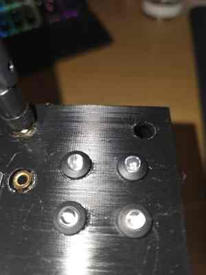

# BELABOX Status LEDs

This module drives four 5 mm status LEDs from the Radxa ROCK 5B+ GPIO header.



*Prototype status-LED panel on the current Cometen BELABOX enclosure. Final enclosure photos will replace this image after the hardware build is complete.*

The normal alert receiver and LED controller run as a user-systemd service. A small root system service is used only for video-pipeline probing because BELABOX `belacoder` runs as root and a normal user cannot always inspect `/proc/<pid>/fd`.

## Hardware

Verified wiring on the Cometen BELABOX:

```text
PIN 32 - PIN_32 - green  - ONLINE / INTERNET
PIN 34 - GND    - common ground
PIN 36 - PIN_36 - blue   - BLUETOOTH AUDIO
PIN 38 - PIN_38 - yellow - VIDEO INPUT
PIN 40 - PIN_40 - red    - BELABOX ENCODER / OUTPUT
```

Use one series resistor per LED:

```text
680 ohm per LED
```

Wiring:

```text
PIN_32 ---- 680R ---->|----+
PIN_36 ---- 680R ---->|----+
PIN_38 ---- 680R ---->|----+---- PIN_34 GND
PIN_40 ---- 680R ---->|----+
```

The latest close-up with the black 5-wire connector at the ROCK 5B+ GPIO header shows the **status-LED wiring**. The separate earlier close-up showing wires beside the heatsink/cooler is the **fan wiring** and should not be used as the LED wiring illustration.

LED anode/long leg goes toward GPIO through the resistor. Cathode/short leg/flat side goes to common ground.

## LED meaning

### Green - ONLINE / INTERNET

- slow blink - internet/relay connectivity has not yet been established
- solid - BELABOX is online and connected to the internet; relay is reachable
- fast blink - internet/relay connectivity was lost after the system had been online
- off - box or `cometen-irl-alerts.service` receiver service is off

### Blue - BLUETOOTH AUDIO

- solid - the configured Bluetooth audio device exists as a PipeWire `Audio/Sink`
- slow blink - the configured Bluetooth audio sink is missing but its Bluetooth/reconnect watchdog service is active
- fast blink - the configured Bluetooth audio sink is missing and its Bluetooth/reconnect watchdog service is also inactive

The LED is not tied to one speaker model. `WPS200`, Soundcore or another compatible Bluetooth speaker may be used depending on the local configuration.

### Yellow - VIDEO INPUT

Yellow and red are intentionally separate.

Yellow means that the current local/network video source is available, even when the BELABOX encoder has intentionally been stopped.

Rules:

- solid - a supported video source is available while encoder is stopped
- solid - encoder is running and the active input pipeline has a valid source
- fast blink - encoder is running but the configured/active video source is not available, for example during V4L2/GStreamer failure, USB disconnect or RTMP publisher loss
- off - no supported video source is currently available

Expected state after pressing **Stop** in BELABOX while the source remains available:

```text
Yellow: SOLID - video input still exists
Red:    OFF   - belacoder/encoder is stopped
```

Supported source types include local device inputs and RTMP.

Local device paths include:

```text
/dev/usb_capture
/dev/hdmirx
/dev/hdmi_capture
```

The configured `camera_device` is checked first and symlinks are resolved to the real video device.

RTMP input is detected separately from device files. The probe first checks the configured nginx-rtmp status endpoint and stream name, and can fall back to detecting an external established publisher on TCP port `1935`. The currently generated BELABOX pipeline is also inspected for `rtmpsrc` so RTMP and local V4L2 inputs are handled as separate source types.

Typical RTMP configuration fields are:

```json
"camera_status_url": "http://127.0.0.1/stat",
"camera_app": "publish",
"camera_stream": "live"
```

### Red - BELABOX ENCODER / OUTPUT

- solid - `belacoder` is running and video input/pipeline is healthy
- fast blink - `belacoder` is running but video input/pipeline is missing
- slow blink - encoder is running but video state cannot be determined
- off - BELABOX encoder is stopped

Red is an encoder/output indicator, not a Twitch/OBS-live indicator.

## Root video probe

The tested BELABOX setup runs `belacoder` as root. A normal user service may be able to see the process but not inspect the file descriptors that prove which video device is actually open.

The solution is:

```text
cometen-irl-video-probe.service   root system service
        |
        | reads /proc + device paths only
        v
/run/cometen-irl-video-status.json
        |
        v
cometen-irl-alerts.service        normal user service
        |
        v
Yellow/red LEDs + !irlstatus
```

The root probe never opens the camera device itself. It only observes existing file descriptors and source paths, so it does not compete with GStreamer for the V4L2 device.

Check the probe file:

```bash
cat /run/cometen-irl-video-status.json
```

Example while encoder and pipeline are active:

```json
{
  "encoder_running": true,
  "source_present": true,
  "pipeline_active": true,
  "active": true,
  "device": "/dev/video1"
}
```

Meaning:

- `source_present` - local/network video source is available
- `pipeline_active` - encoder pipeline has the active video source
- `encoder_running` - `belacoder` is running
- `active` - effective yellow-LED input state

Example with encoder intentionally stopped but camera still present:

```json
{
  "encoder_running": false,
  "source_present": true,
  "pipeline_active": false,
  "active": true,
  "device": "/dev/video1"
}
```

Only fresh probe data is trusted. The normal stale threshold is a few seconds; if the root probe is unavailable or stale, the LED module can fall back to older local detection.

## Startup lamp test

When enabled, the LED module performs:

```text
green -> blue -> yellow -> red -> all
```

Typical step time is 0.3 seconds.

## Repository path

Fresh installations use `~/CometenIRLSystem`. Existing pre-rename installations may still use `~/CometenIRLAlerts`; keep the existing path unless a deliberate service-path migration is performed.

## Install/update GPIO and video probe

Fresh post-rename checkout:

```bash
cd ~/CometenIRLSystem
git pull
cd receiver
bash ./install-gpio-leds.sh
```

Existing pre-rename checkout:

```bash
cd ~/CometenIRLAlerts
git pull
cd receiver
bash ./install-gpio-leds.sh
```

The installer handles the GPIO dependencies/group/udev setup and installs/updates the root video-probe service.

On first GPIO installation, a reboot is recommended so group changes are fully active:

```bash
sudo reboot
```

If the GPIO group is already active, a user-service restart is normally enough:

```bash
systemctl --user restart cometen-irl-alerts.service
```

Check root probe:

```bash
sudo systemctl status cometen-irl-video-probe.service --no-pager
cat /run/cometen-irl-video-status.json
```

## Receiver configuration

Relevant local `receiver/config.json` section:

```json
"status_leds_enabled": true,
"status_leds": {
  "green_line": "PIN_32",
  "blue_line": "PIN_36",
  "yellow_line": "PIN_38",
  "red_line": "PIN_40",
  "active_high": true,
  "poll_seconds": 2.0,
  "lamp_test": true,
  "lamp_test_seconds": 0.3,
  "bluetooth_sink_match": "WPS200",
  "bluetooth_watchdog_service": "cometen-wps200.service",
  "camera_device": "/dev/usb_capture",
  "camera_status_url": "http://127.0.0.1/stat",
  "camera_app": "publish",
  "camera_stream": "live",
  "live_process": "belacoder",
  "video_probe_seconds": 0.5,
  "video_probe_stale_seconds": 3.0
}
```

Adjust the sink match and camera/RTMP fields to the actual installation. Do not commit the local config.

## Test only the LEDs

From a fresh post-rename checkout:

```bash
cd ~/CometenIRLSystem/receiver
python3 status_leds.py config.json --test
```

Use `~/CometenIRLAlerts/receiver` instead on an existing pre-rename checkout.

Expected:

```text
green -> blue -> yellow -> red -> all
```

## Video/encoder test sequence

1. Camera/RTMP source available + BELABOX running -> yellow solid, red solid.
2. Press Stop in BELABOX while the source remains available -> yellow remains solid, red turns off.
3. Start BELABOX -> red becomes solid again when pipeline is active.
4. A real V4L2/GStreamer, USB or RTMP publisher drop while encoder is running should produce the configured yellow/red fault pattern.

Watch:

```bash
cat /run/cometen-irl-video-status.json
journalctl --user -u cometen-irl-alerts.service -f
```

## Compatibility note

The repository/project branding is Cometen IRL System. Existing service names such as `cometen-irl-alerts.service` are intentionally retained so deployed BELABOX installations continue to work.

## Related documentation

- [Receiver setup](receiver-setup.md)
- [Watchdog and Heartbeat](WATCHDOG_HEARTBEAT.md)
- [BELABOX Stability](BELABOX_STABILITY.md)
